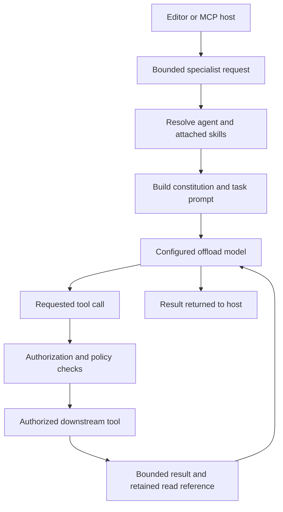
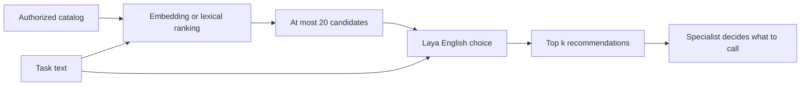

# 4. Architecture deep dive

[← Examples](examples.md) · [Contents](README.md) · [Testing →](testing.md)

## Execution and ownership

The host owns orchestration and final synthesis. Prism owns specialist execution,
its run limits, and authorization. Each specialist sees its constitution and
selected skills rather than the entire library.

A release bundle is immutable content inside the executable. Runtime extensions
are separately tracked user-added agents and skills. A workspace is repository
data inspected by a task. These identities have separate provenance and lifecycle.
See [the project glossary](../../CONTEXT.md).

## Tool retrieval and reranking

MiniLM/Potion compares task and tool-description embeddings. If the selected
model is unavailable, explicit recommendations use lexical overlap and report
warnings. Tool inventories and vectors are cached per runner.

Laya receives one `choice` question containing candidate IDs, names, and
descriptions. Prism preserves retrieval order in JSON, explicitly selects
English, and sets total/head token budgets to 1024/512. It validates every
candidate probability and the distribution sum, then sorts the candidates.
It returns at most the requested `top_k` (1–10; default 5).

Kev/Jev uses one independent `noul` question per candidate in the same HTTP
request. That score meaning differs from a categorical choice distribution.
Our [evaluation](../laya-evaluation.md) found that Laya needed the categorical
format to achieve useful ranking on the tested tasks.

## Failure and concurrency behavior

Only one decision exchange runs at a time per client. The hard HTTP deadline
is five seconds. If a caller's shorter deadline expires, Prism returns promptly
while the outstanding exchange finishes. A hard ambiguous timeout disables the
adapter until restart so inference does not silently accumulate.

A failed reranker preserves retrieval order and adds a warning. Automatic
injection has a separate 500 ms budget and is opt-in; it is not a second,
unbounded scoring path. The measured English CPU service exceeds that budget
at 20 candidates.

Tool recommendations cannot grant access. The selected catalog is authorized
before ranking and a tool call is checked again before execution. Large outputs
are retained for their owning run, with bounded previews and read references;
retention ends with the run.

## Where to read the code

| Responsibility | Starting point |
| --- | --- |
| Catalog retrieval and reranking | [`recommend.go`](../../internal/app/recommend.go) |
| Decision HTTP adapter and score validation | [`kev.go`](../../internal/toolmodel/kev.go) |
| Persistent Laya setup | [`install_laya.go`](../../internal/cli/install_laya.go) |
| Installer selection and saved settings | [`install_tool_routing.go`](../../internal/cli/install_tool_routing.go) |
| Agent execution and prompt assembly | [`runner.go`](../../internal/app/runner.go) |
| Offload model adapters | [`internal/llm`](../../internal/llm) |
| Downstream MCP clients | [`internal/downstreammcp`](../../internal/downstreammcp) |

Long tasks, verbose descriptions, unseen languages, no-relevant-tool cases,
concurrent load, and probability calibration need broader evaluation. The small
smoke sample does not establish general production accuracy.
