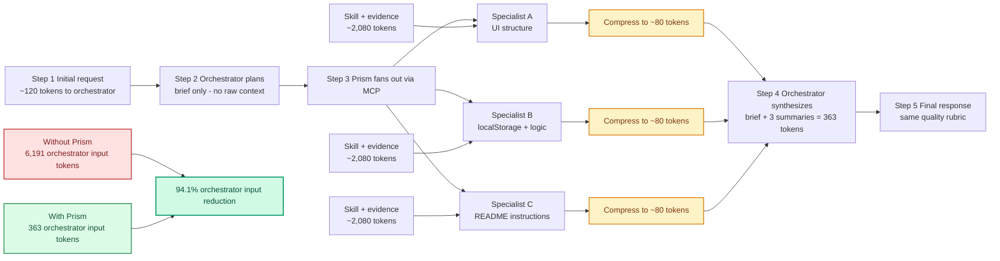
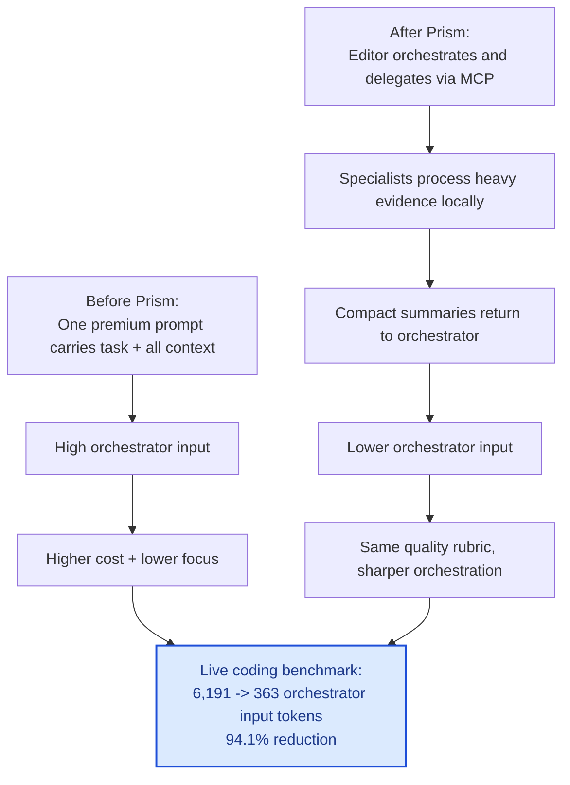

# Why Prism reduces orchestrator input tokens

This document explains the mechanism behind Prism's token reduction, with visual diagrams showing how the architecture works.

## The core insight

Prism reduces **orchestrator input** — the tokens the premium model has to read — by routing evidence-heavy work to local specialists that compress their findings into compact summaries. The orchestrator never sees the raw context.

This is not about reducing total computation. The same information gets processed. The difference is *where* it gets processed and *what* flows back.

---

## How the reduction works (step by step)

### Without Prism: one fat prompt

The premium model receives everything in a single context window:

| Component | Typical tokens |
|---|---:|
| User task | ~120 |
| Repo rules | ~400 |
| Skill docs (full bodies) | ~2,000 |
| Raw evidence (CI logs, K8s state, docs) | ~3,000 |
| Constitution | ~300 |
| Chat history | ~400 |
| **Total orchestrator input** | **~6,191** |

The model reads all of it, reasons through all of it, and produces a response. You pay for every token.

### With Prism: brief + compressed summaries

The orchestrator receives only what it needs to make a decision:

| Component | Typical tokens |
|---|---:|
| User task (same as before) | ~120 |
| Compact summary from specialist A | ~80 |
| Compact summary from specialist B | ~80 |
| Compact summary from specialist C | ~80 |
| **Total orchestrator input** | **~363** |

That's it. The orchestrator's job becomes **synthesis and judgment**, not evidence processing.

### Where the other 5,828 tokens went

They were processed **inside the local specialists on Ollama at $0**. Each specialist ingests:

| Component | Typical tokens |
|---|---:|
| Narrow subtask prompt | ~80 |
| Relevant skill body (only one) | ~600 |
| Targeted evidence slice (only what this agent needs) | ~1,200 |
| Agent constitution | ~200 |
| **Total specialist input** | **~2,080** |

But those tokens:

1. Run on local Ollama (free compute)
2. Never enter the premium model's context window
3. Never leave the specialist except as a ~80 token structured summary

### The compression step

This is the critical mechanism. A specialist does not forward its raw input back to the orchestrator. It **processes and distills**:

1. Reads ~2,000 tokens of raw evidence (CI log, K8s state, docs page, etc.)
2. Reasons through it using its skill instructions and constitution constraints
3. Produces a structured JSON envelope: `{summary, findings, artifacts, confidence}`
4. That envelope is **~80 tokens** — a 96% compression of the raw input

The specialist acts as a **lossy compressor** that preserves signal and discards noise. The orchestrator receives high-signal summaries instead of raw dumps.

### Why this compounds (and why orchestrator input stays flat)

Without Prism, every piece of context you add — another skill, another log file, another runbook — **linearly increases** orchestrator input. More context means higher cost and lower model focus.

With Prism, adding more context to a specialist **does not change orchestrator input**. The specialist absorbs extra evidence locally and still returns the same ~80 token summary. Orchestrator input stays nearly flat regardless of how much raw material the specialists process.

```
Context growth vs orchestrator input:

Without Prism:  orchestrator input ≈ O(total context)
With Prism:     orchestrator input ≈ O(number of specialists × summary size)
```

This is why the savings grow with real workloads. A todo-app benchmark shows 94.1%. A production incident with CI logs + K8s dumps + runbooks + chat history shows 97%+ because the raw evidence is larger but specialist summaries stay the same size.

---

## Technical flow diagram

This diagram shows the full delegation path: initial request fans out to specialists, each processes with its own scoped inputs, and only compact summaries flow back to the orchestrator for final synthesis.





### Reading the diagram

- **Steps 1–3:** The request arrives and the orchestrator decides which specialists to invoke via MCP. At this point, the orchestrator has seen only the brief task (~120 tokens).
- **Fan-out:** Each specialist receives its own scoped evidence (heavy raw context) plus its skill body. This happens locally on Ollama.
- **Compression:** Each specialist distills its findings into a compact summary (~80 tokens each).
- **Steps 4–5:** The orchestrator reads only the brief + summaries (363 tokens total) and synthesizes the final response.

The raw evidence (CI logs, K8s state, full skill docs) never enters the orchestrator's context. That is where the 94.1% reduction comes from.

---

## Executive flow diagram

This diagram shows the before/after at a higher level: what changes in cost and quality when you move from one heavy prompt to a delegated architecture.





---

## The analogy

Instead of the CEO reading every department's full reports, incident logs, and documentation themselves, each department head reads their own material and sends a one-paragraph executive summary. The CEO's reading load drops 94%, but the same information was processed and distilled somewhere in the organization.

The premium model is the CEO. The local specialists are the department heads. The MCP delegation layer is the routing that connects them.

---

## Key takeaways

1. **Total computation doesn't disappear** — it moves to local Ollama at $0.
2. **The specialist is a compressor** — it processes raw evidence and outputs a structured summary (~80 tokens).
3. **Orchestrator input stays flat** — adding more evidence to specialists doesn't grow orchestrator input.
4. **Quality is preserved** — both paths pass the same rubric because the summaries carry the signal the orchestrator needs for judgment.
5. **Savings grow with context size** — the heavier your real workload's context (CI logs, cluster state, runbooks, docs), the larger the gap between baseline and delegated.

---

## Regenerating the SVG images

After editing the Mermaid source files:

```bash
npx -y @mermaid-js/mermaid-cli -i docs/img/workflow-token-technical.mmd -o docs/img/workflow-token-technical.svg
npx -y @mermaid-js/mermaid-cli -i docs/img/workflow-token-executive.mmd -o docs/img/workflow-token-executive.svg
```
